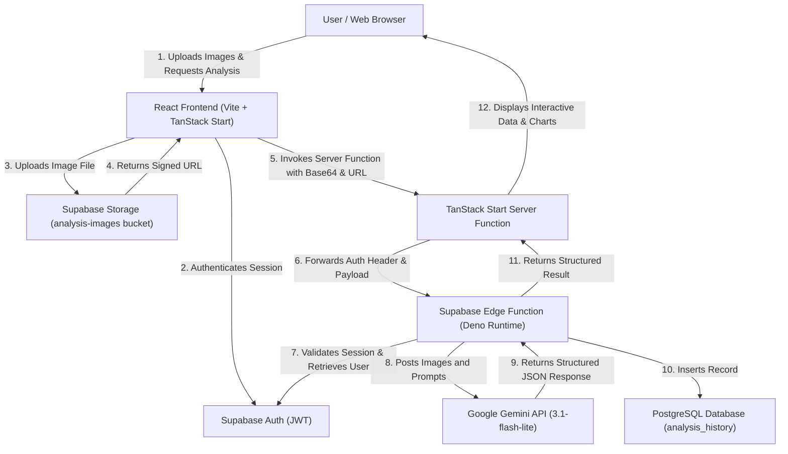

# VisionVerify 🔍

[](https://react.dev/)
[](https://www.typescriptlang.org/)
[](https://vite.dev/)
[](https://tanstack.com/start)
[](https://supabase.com/)
[](https://www.postgresql.org/)
[](https://opensource.org/licenses/MIT)

VisionVerify is a professional, enterprise-grade AI-powered product intelligence, comparison, and counterfeit detection platform. By leveraging computer vision and advanced multimodal large language models (LLMs), VisionVerify enables consumers, brand protection agencies, and businesses to instantly verify product authenticity, analyze digital manipulations, recognize product specifications, and perform side-by-side spec sheets and value comparisons.

---

## Overview

In the modern e-commerce landscape, buyers and brands suffer from two primary issues: the rise of highly sophisticated counterfeit physical goods and the spread of deceptive AI-generated or manipulated product imagery. 

VisionVerify solves this by offering a unified computer vision platform. Users upload images of products to:
1. **Recognize:** Automatically extract product metadata, launch years, manufacturer histories, and exact specifications.
2. **Detect Fakes:** Run a brand protection audit on packaging, logo kerning, finish, materials, and serial alignment.
3. **Verify AI-Generation:** Scan files for digital edits, lighting mismatches, and background artifacts to check if an image is real or AI-generated.
4. **Compare Products:** Perform parallel vision-based specification, pricing, and value comparisons between two items.

All results are processed via secure serverless Edge Functions and archived in a relational database history dashboard, providing users with a comprehensive, auditable record.

---

## Features

* **Product Recognition:** Automates identification of brand, model, manufacturer, and key specifications directly from product images.
* **Product Comparison:** Compares two distinct products side-by-side, generating spec sheets, pros/cons lists, price analyses, and value verdicts.
* **Fake Image Detection:** Audits images for counterfeit traits, analyzing seams, finish, print consistency, logo alignment, and serial numbers.
* **AI Content Detection:** Performs deep forensic analysis of lighting mismatch, finger anomalies, face inconsistencies, and digital edit artifacts (clone-stamp, warp).
* **User Authentication:** Safe registration, login, and session persistence powered by Supabase Auth (JWT verification).
* **Profile Management:** Auto-generates user profiles using Auth metadata triggers and supports custom avatars.
* **Image Upload & Storage:** Securely uploads product images to Supabase Storage with Row Level Security (RLS) policies.
* **Real-time Results:** Displays beautiful, interactive loading states, confidence scores, stat cards, and dynamic data tables.

---

## Tech Stack

### Frontend
* **Core Framework:** React 19 (Functional Components, Hooks)
* **Language:** TypeScript (Strict Type Safety)
* **Build Tool:** Vite 7 (Fast ESM Hot Module Replacement)
* **Server/Client Routing:** TanStack Router (Fully typesafe routes, nested layout shells)
* **SSR/CSR Integration:** TanStack Start (Server Actions, Server Functions, client dehydration)
* **Styling:** Tailwind CSS + Radix UI Primitives (Sleek, responsive glassmorphic dark-mode UI)
* **Component Library:** Shadcn UI (Card, Dialog, Accordion, Menubar, etc.)

### Backend & Infrastructure
* **BaaS Provider:** Supabase
* **Database:** PostgreSQL (Relational schema, Check constraints, Foreign keys)
* **Security:** Row Level Security (RLS) Policies (Context-aware database access control)
* **Serverless Functions:** Supabase Edge Functions (Deno Edge runtime, zero-cold-start execution)
* **Cloud Storage:** Supabase Storage (Buckets for secure user and asset storage)

### AI & Cloud Services
* **AI Engine:** Google Gemini API (`gemini-3.1-flash-lite` multimodal vision model)
* **Integration API:** Google Generative Language REST Endpoint (Multimodal JSON Schema Response)

---

## System Architecture



---

## Database Design

The database schema is fully relational, optimized with check constraints, foreign keys, and cascading deletes to prevent orphaned records. RLS is enforced at the table level.

```sql
-- 1. User Profiles (Extends auth.users metadata)
CREATE TABLE public.profiles (
  id uuid PRIMARY KEY REFERENCES auth.users(id) ON DELETE CASCADE,
  email text,
  full_name text,
  avatar_url text,
  created_at timestamptz NOT NULL DEFAULT now(),
  updated_at timestamptz NOT NULL DEFAULT now()
);

-- 2. Product Records (Global Product Catalog)
CREATE TABLE public.products (
  id uuid PRIMARY KEY DEFAULT gen_random_uuid(),
  name text NOT NULL,
  brand text,
  category text,
  model_number text,
  launch_year integer,
  current_price text,
  specifications jsonb DEFAULT '{}'::jsonb,
  description text,
  image_url text,
  created_at timestamptz NOT NULL DEFAULT now()
);

-- 3. Analysis & Detection History
CREATE TABLE public.analysis_history (
  id uuid PRIMARY KEY DEFAULT gen_random_uuid(),
  user_id uuid NOT NULL REFERENCES auth.users(id) ON DELETE CASCADE,
  analysis_type text NOT NULL CHECK (analysis_type IN ('product_recognition', 'ai_detection', 'fake_detection', 'product_comparison')),
  image_url text,
  result jsonb NOT NULL DEFAULT '{}'::jsonb,
  confidence_score numeric,
  created_at timestamptz NOT NULL DEFAULT now()
);
```

---

## Backend Architecture

### 1. Authentication Flow
- Supabase Auth handles email/password registration and logins.
- Upon user sign-up, a PostgreSQL trigger (`on_auth_user_created`) automatically invokes `public.handle_new_user()` to populate the `profiles` table with the user's email, name, and avatar URL.
- Subsequent client requests carry the session JWT in the `Authorization: Bearer <token>` header.

### 2. API Flow
- Client triggers a React Query mutation, which initiates the upload of images to `storage`.
- The client calls a TanStack Start Server Function (`createServerFn`), routing the request through the server-side auth middleware (`requireSupabaseAuth`) to inspect the JWT claims.
- The Server Function invokes the remote Supabase Edge Function using `supabase.functions.invoke`, passing along the user's `Authorization` header to maintain context and security boundaries.

### 3. Row Level Security (RLS) Policies
- **Profiles:** Users can only `SELECT`, `INSERT`, and `UPDATE` their own profile records (`auth.uid() = id`).
- **Products:** All authenticated users have read-only access (`SELECT`) to products.
- **Analysis History:** Users can only view, insert, or delete their own records (`auth.uid() = user_id`).
- **Storage:** Public read for profile and product images. Private folder structure for analysis images:
  ```sql
  bucket_id = 'analysis-images' AND (storage.foldername(name))[1] = auth.uid()::text
  ```

---

## API Documentation

All analysis operations route through Supabase Edge Functions. The Edge Functions expect a `POST` request with a valid `Authorization` JWT header and return structured JSON.

### 1. Product Recognition API
* **Endpoint:** `/functions/v1/analyze-product`
* **Request Format:**
```json
{
  "imageBase64": "data:image/jpeg;base64,...",
  "mimeType": "image/jpeg",
  "imageUrl": "https://kdwvsofcbbmixsckapap.supabase.co/storage/v1/object/sign/analysis-images/..."
}
```
* **Response Format (200 OK):**
```json
{
  "result": {
    "basic_information": {
      "product_name": "iPhone 15 Pro Max",
      "brand": "Apple",
      "manufacturer": "Apple Inc.",
      "model_number": "A2849",
      "category": "Phones",
      "product_type": "Smartphone",
      "confidence": 0.98
    },
    "company_information": {
      "company_name": "Apple Inc.",
      "founders": ["Steve Jobs", "Steve Wozniak", "Ronald Wayne"],
      "ceo": "Tim Cook",
      "country_of_origin": "USA",
      "official_website": "https://apple.com",
      "year_founded": "1976"
    },
    "pricing": {
      "current_market_price": "$1199",
      "launch_price": "$1199",
      "currency": "USD"
    },
    "specifications": {
      "Display": "6.7-inch OLED",
      "Processor": "A17 Pro",
      "RAM": "8GB",
      "Storage": "256GB/512GB/1TB"
    }
  },
  "historyId": "3b2c1d0a-4e5f-6a7b-8c9d-0e1f2a3b4c5d",
  "confidence": 0.98,
  "provider": "google-gemini",
  "model": "gemini-3.1-flash-lite"
}
```

### 2. Product Comparison API
* **Endpoint:** `/functions/v1/compare-products`
* **Request Format:**
```json
{
  "imageBase64": "data:image/jpeg;base64,...",
  "mimeType": "image/jpeg",
  "imageUrl": "https://...",
  "imageBase64B": "data:image/jpeg;base64,...",
  "mimeTypeB": "image/jpeg",
  "imageUrlB": "https://..."
}
```
* **Response Format (200 OK):**
```json
{
  "result": {
    "product_a": { "name": "BMW M4", "brand": "BMW" },
    "product_b": { "name": "Mercedes C63 AMG", "brand": "Mercedes" },
    "spec_comparison": [
      { "label": "Engine", "a": "3.0L Inline 6 Twin-Turbo", "b": "4.0L V8 Twin-Turbo" }
    ],
    "winner": "a",
    "winner_reason": "Lighter chassis, better handling dynamics, and more modern interior tech.",
    "recommendation": "Choose Product A for track use and resale value, or Product B for daily luxury comfort."
  },
  "historyId": "5c6d7e8f-9a0b-1c2d-3e4f-5a6b7c8d9e0f",
  "confidence": 0.95
}
```

---

## Folder Structure

```
├── .env.example
├── README.md
├── package.json
├── tsconfig.json
├── vite.config.ts
├── components.json
├── src/
│   ├── components/
│   │   ├── ui/                       # Shadcn UI primitives
│   │   ├── app-shell.tsx             # Sidebar and navigation shell
│   │   ├── image-input.tsx           # Multi-format base64 image uploader
│   │   └── result-actions.tsx        # PDF, CSV, and share actions
│   ├── hooks/                        # Custom React Hooks
│   ├── integrations/
│   │   └── supabase/
│   │       ├── client.ts             # Client-side Supabase SDK instance
│   │       ├── client.server.ts      # Server-side Admin client (service role)
│   │       ├── auth-middleware.ts    # React-Start middleware for JWT auth
│   │       └── types.ts              # Database auto-generated TypeScript declarations
│   ├── lib/
│   │   ├── analyze.functions.ts      # Frontend Server functions calls
│   │   ├── error-capture.ts          # Server-side uncaught exception handler
│   │   └── error-page.ts             # HTML error template fallback
│   ├── routes/                       # File-system routes
│   │   ├── _authenticated/
│   │   │   ├── ai-detection.tsx      # AI/manipulation scan page
│   │   │   ├── dashboard.tsx         # Dashboard history feed
│   │   │   ├── fake-detector.tsx     # Counterfeit inspector page
│   │   │   ├── product-comparison.tsx# Double-image comparison page
│   │   │   ├── product-recognition.tsx# Single-image recognizer page
│   │   │   └── profile.tsx           # User settings and profile page
│   │   ├── auth.tsx                  # Sign-in/Sign-up screen
│   │   ├── index.tsx                 # Root landing page router
│   │   └── __root.tsx                # Context provider and layout frame
│   ├── router.tsx                    # TanStack Router initialization
│   ├── start.ts                      # Client-side entry point
│   ├── server.ts                     # Server-side SSR entry wrapper
│   └── styles.css                    # Tailwind CSS configuration imports
└── supabase/
    ├── config.toml                   # Supabase local environment config
    ├── migrations/                   # SQL migration tracking files
    └── functions/                    # Serverless Edge Functions
        ├── _shared/
        │   └── analyze.ts            # Common Gemini handler, prompt templates, & db client
        ├── analyze-product/          # Product Recognition function
        ├── compare-products/         # Side-by-side comparison function
        ├── detect-ai/                # AI manipulation analysis function
        └── detect-fake/              # Brand authenticity audit function
```

---

## Installation

### 1. Clone the project locally
```bash
git clone https://github.com/your-username/vision-verify.git
cd vision-verify
```

### 2. Install package dependencies
```bash
npm install
```

### 3. Set up Environment Variables
Copy the template environment file and populate it with your Supabase variables:
```bash
cp .env.example .env
```

### 4. Link & Configure Supabase CLI
Initialize and link the project to your Supabase instance:
```bash
supabase link --project-ref your-project-ref
```

### 5. Set Remote API Keys (Secrets)
Set your Google AI Studio API key in Supabase Secrets for Edge Functions:
```bash
supabase secrets set GEMINI_API_KEY=your-google-gemini-api-key
```

### 6. Push database schema
Push migrations to your remote database:
```bash
supabase db push
```

### 7. Deploy Edge Functions
Deploy all Deno Edge Functions:
```bash
supabase functions deploy --use-api
```

### 8. Run the local development server
```bash
npm run dev
```

---

## Environment Variables

To configure your application, copy the template `.env.example` file and populate it with your Supabase and Gemini API credentials:

```bash
cp .env.example .env
```

Open the newly created `.env` file and enter your values:

| Variable Name | Description | Required | Scope |
| :--- | :--- | :--- | :--- |
| `SUPABASE_URL` | Endpoint URL of your Supabase instance | Yes | Backend & Client |
| `SUPABASE_PUBLISHABLE_KEY` | Public anon key for client-side API requests | Yes | Client |
| `SUPABASE_PROJECT_ID` | Project Reference ID of your Supabase instance | Yes | CLI & Backend |
| `VITE_SUPABASE_URL` | Injected URL variable for Vite compilation (Client) | Yes | Client |
| `VITE_SUPABASE_PUBLISHABLE_KEY`| Injected public key for Vite compilation (Client) | Yes | Client |
| `VITE_SUPABASE_PROJECT_ID` | Injected project reference ID for client environment | Yes | Client |
| `GEMINI_API_KEY` | Google AI Studio Key (Set as remote secret on Supabase) | Yes | Edge Functions |

> [!IMPORTANT]
> The `GEMINI_API_KEY` is a secret key and must **never** be placed in your local `.env` file or committed to Git. Instead, set it securely in your remote Supabase secrets using:
> `supabase secrets set GEMINI_API_KEY=your-api-key`

---

## Usage

1. **Register/Login:** Navigate to the auth screen and register an account. Confirm email verification if required.
2. **Dashboard Overview:** Upon login, check the **Dashboard** to view your recent comparison history and verification cards.
3. **Analyze a Product:**
   - Go to **Product Recognition** and upload a clear picture of any item (e.g., electronic devices, motorcycles, fashion accessories).
   - Click "Analyze Product" to retrieve the full specification sheet and brand profile.
4. **Audit Authenticity:**
   - Go to **Fake Detector** and upload an image of a luxury brand or electronics item.
   - The AI inspects for logo quality, labels, seams, stitching, and serial numbers, assigning an authenticity risk score.
5. **Scan for AI Content:**
   - Upload any portrait, scene, or item to **AI Detection** to determine if the image is real, AI-generated, or edited.
6. **Side-by-Side Comparison:**
   - Go to **Product Comparison**, upload Product A and Product B images, and click "Compare Products" to review attributes side-by-side.

---

## Security Features

- **JWT-Protected Server RPCs:** Frontend server functions verify the user's session JWT before executing the endpoint operations.
- **Context-Bound Edge Invocation:** Edge Functions require the user's bearer token in the headers, performing `supabase.auth.getUser()` to isolate database insertions to the specific authenticated `user_id`.
- **Database Row Level Security (RLS):** All data manipulation is protected by custom PostgreSQL RLS policies, ensuring users can never read, modify, or delete another user's history logs.
- **Secure Storage Buckets:** Private storage policies restrict access to the `analysis-images` bucket using folders prefixed by the user's UUID (`auth.uid()`).
- **Input Sanitization:** Uses `Zod` validators to enforce strong payload schema parsing and validation.

---

## Screenshots


#### 1. Analysis Dashboard


#### 2. Single Product Recognition Report


#### 3. Side-by-Side Comparison Matrix


#### 4. Forensic AI Manipulation Inspector
``

---

## Challenges Solved

- **503 High Demand Errors / Rate Limits (429):** Older Gemini models frequently experienced demand spikes or strict rate-limits on the free tier. We diagnosed key limitations through logs and upgraded the integration to **`gemini-3.1-flash-lite`**, establishing an efficient, high-availability visual analysis pipeline.
- **Database Insertion Contraints:** Fixed an SQL constraint check error on the remote Supabase database that rejected `product_comparison` and `fake_detection` types. Pushed a migration altering the check constraint to dynamically support new features.
- **Variable Shadowing Compile Errors:** Identified a block-scope redeclaration warning in the Edge Function's Gemini handler which was causing `BOOT_ERROR` crashes in Supabase Edge Runtime. Cleaned up the variable declarations to ensure error-free compilation in Deno.

---

## Future Enhancements

- **Object Detection Box Overlays:** Implement Canvas drawing on the frontend to display coordinate boxes over suspicious regions flagged by the AI-Generated detector.
- **Bulk PDF Reporting:** Implement server-side rendering of PDF files for downloadable product intelligence reports.
- **Integrated Catalog Search:** Add automated catalog indexing to match verified items against a pre-existing inventory database.

---

## Deployment

### Frontend Deployment
The frontend is built using standard Vite. It can be compiled and deployed to platforms supporting Node/SSR builds (e.g. Vercel, Netlify, or VPS):
```bash
npm run build
npm run preview
```

### Backend Deployment
Database migrations and Serverless Functions are pushed directly to Supabase:
```bash
supabase db push
supabase functions deploy --use-api
```

---

## Author

**Devesh**
* **Portfolio:** [devesh.dev](https://devesh.dev)
* **GitHub:** [@DeveshV](https://github.com/DeveshV)
* **LinkedIn:** [linkedin.com/in/devesh-v](https://linkedin.com/in/devesh-v)

---

## License

This project is licensed under the MIT License - see the [LICENSE](LICENSE) file for details.
